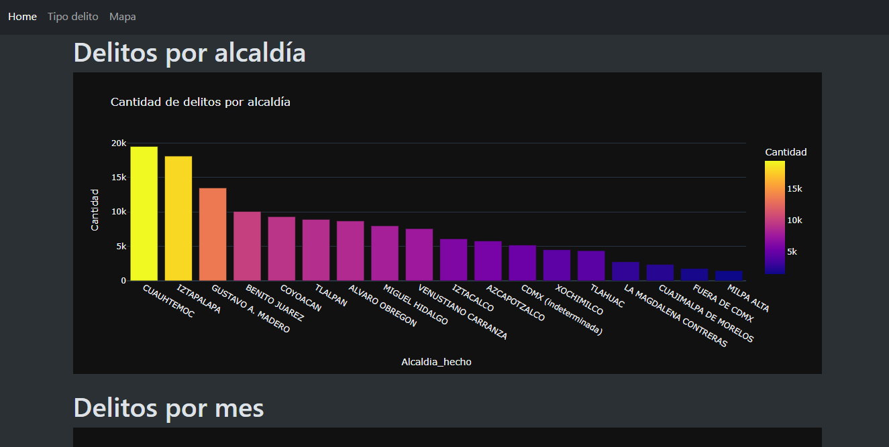
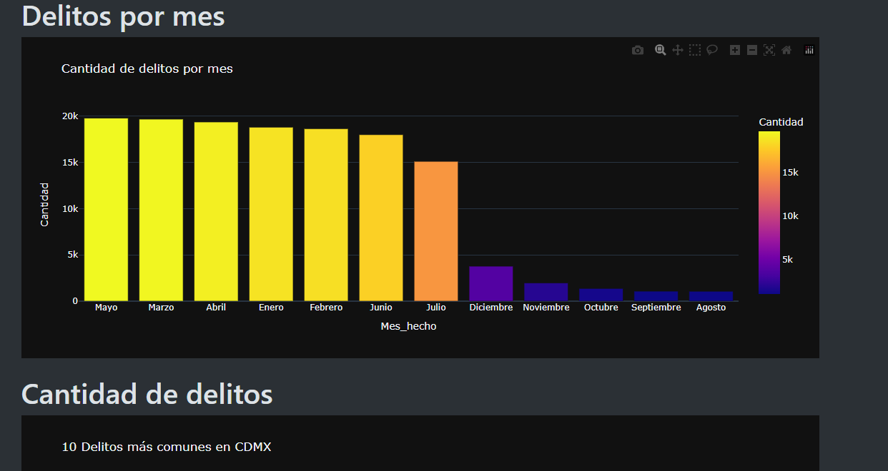
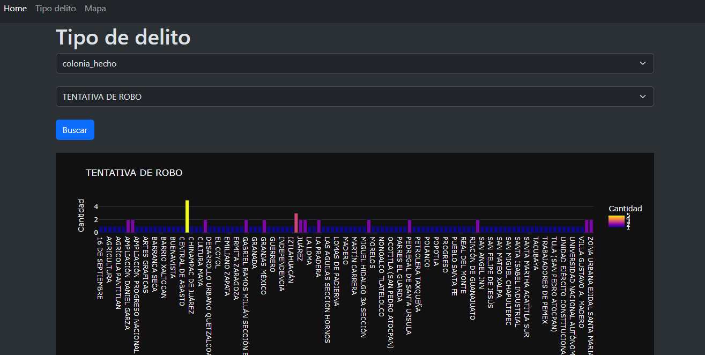
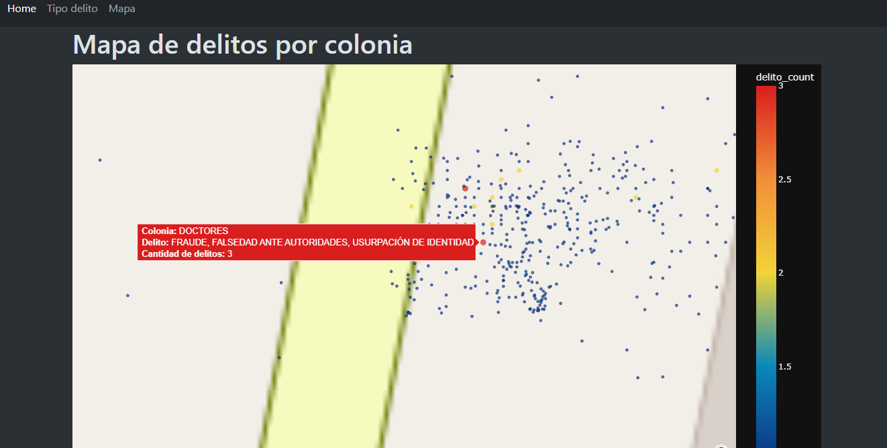
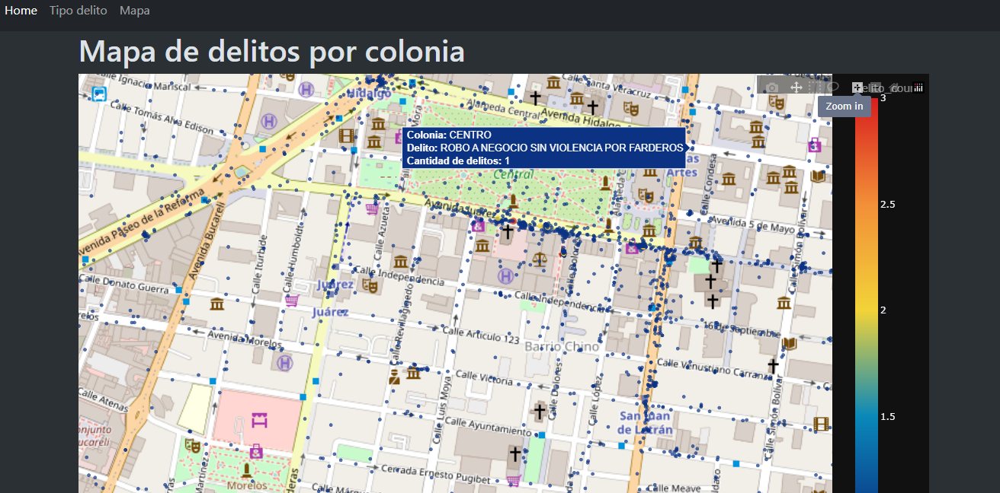

# Delitos-CDMX


## Requisitos
- Python 3.x
- Django
- Plotly
- Pandas

## Uso
1. Clorar el repositorio

```bash
git clone https://github.com/brianrscode/delitos-CDMX.git
cd delitos-CDMX
```

2. Crear un entorno virtual

```bash
python -m venv env
```

3. Activar el entorno virtual
    - Linux o Mac
    ```bash
    source env/bin/activate
    ```
    - Windows
    ```bash
    env\Scripts\activate
    ```

4. Instalar las dependencias
```bash
pip install -r requirements.txt
```

5. Iniciar la aplicación
```bash
python manage.py runserver
```

## Ejemplos de uso
<table>
    <tr>
        <td>
            
        </td>
        <td>
            
        </td>
    </tr>
    <tr>
        <td>
            
        </td>
        <td>
            
        </td>
    </tr>
    <tr>
        <td>
            
        </td>
        <td>
            
        </td>
    </tr>
</table>